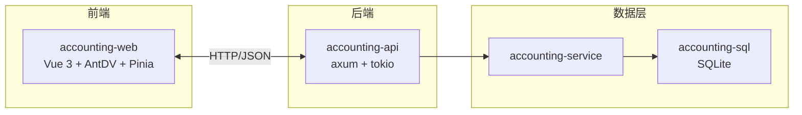
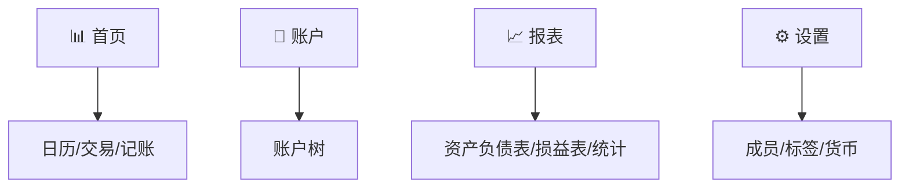
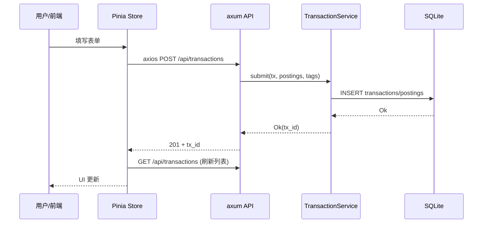
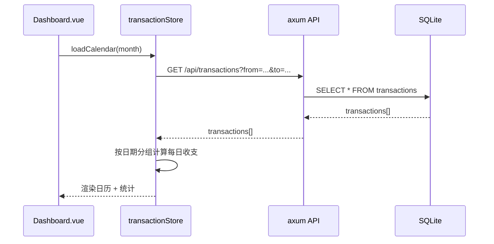

# Web UI 设计文档

> Phase 3：基于 Ant Design Vue 1.x + TypeScript 的响应式 Web 记账界面。

## 1. 背景与目标

Phase 1-2 已完成核心记账功能（CLI + 数据库 + 统计报表）。Phase 3 目标是为同一 SQLite 数据库提供 Web UI 访问方式，实现与 CLI 等价的功能。

**核心原则**：

- Web UI 和 CLI 共享同一 SQLite 数据库文件
- Web UI 支持的所有功能，CLI 也支持（反之亦然）
- 响应式布局，适配 PC、平板、手机

## 2. 架构设计

### 2.1 整体架构



### 2.2 新增组件

| 组件 | 类型 | 职责 |
|------|------|------|
| `accounting-api` | Rust crate | axum HTTP 服务，REST API 路由，请求/响应序列化 |
| `accounting-web` | npm 项目 | Vue 3 + TypeScript 前端，独立构建 |

### 2.3 启动方式

```bash
# 启动 API 服务（默认端口 3000）
cargo run -p accounting-api -- --db my.db

# 前端开发服务器（独立终端）
cd accounting-web && npm run dev

# 生产构建：前端静态文件由 axum 托管
# accounting-api 内置 frontend/dist 目录的静态文件服务
```

## 3. 后端 API 设计

### 3.1 通用约定

- 基路径：`/api`
- 数据格式：JSON
- 日期格式：`YYYY-MM-DD`（请求）/ `YYYY-MM-DD HH:MM:SS`（响应）
- 金额格式：字符串（如 `"123.45"`），避免浮点精度问题
- 错误响应：`{ "error": "错误信息" }`

### 3.2 路由表

#### 成员

| 方法 | 路径 | 说明 |
|------|------|------|
| GET | `/api/members` | 成员列表 |
| POST | `/api/members` | 创建成员 `{ "name": "..." }` |
| DELETE | `/api/members/:id` | 删除成员 |

#### 账户

| 方法 | 路径 | 说明 |
|------|------|------|
| GET | `/api/accounts` | 账户列表（含余额） |
| GET | `/api/accounts/tree` | 账户树结构（含层级关系） |
| POST | `/api/accounts` | 创建账户 `{ "full_name": "...", "billing_day": null, "repayment_day": null }` |
| GET | `/api/accounts/:id/balance` | 账户余额（含子账户聚合） |

#### 交易

| 方法 | 路径 | 说明 |
|------|------|------|
| GET | `/api/transactions` | 交易列表（支持 `?from=&to=&account=&member=&tag=&keyword=&limit=&offset=`） |
| POST | `/api/transactions` | 创建交易 |
| GET | `/api/transactions/:id` | 交易详情（含分录、标签） |
| DELETE | `/api/transactions/:id` | 删除交易 |

**POST /api/transactions 请求体**：

```json
{
  "date_time": "2024-06-04 12:30:00",
  "description": "午餐",
  "member_id": 1,
  "postings": [
    { "account": "支出:餐饮", "commodity": "CNY", "amount": "-45.00" },
    { "account": "资产:现金", "commodity": "CNY", "amount": "45.00" }
  ],
  "tags": ["餐饮", "工作餐"]
}
```

#### 标签

| 方法 | 路径 | 说明 |
|------|------|------|
| GET | `/api/tags` | 标签列表 |
| POST | `/api/tags` | 创建标签 |
| DELETE | `/api/tags/:name` | 删除标签 |

#### 货币

| 方法 | 路径 | 说明 |
|------|------|------|
| GET | `/api/commodities` | 货币列表 |

#### 报表

| 方法 | 路径 | 说明 |
|------|------|------|
| GET | `/api/reports/balance-sheet` | 资产负债表 |
| GET | `/api/reports/income-statement` | 损益表 |
| GET | `/api/reports/stats?by=tag&from=&to=&...` | 按维度统计（`by=tag/member/channel`） |

#### 当前用户

| 方法 | 路径 | 说明 |
|------|------|------|
| GET | `/api/me` | 当前成员信息（前端状态） |
| PUT | `/api/me` | 切换当前成员 `{ "member_id": 1 }` |

### 3.3 后端实现要点

- `accounting-api` 依赖 `accounting-service` 和 `accounting-sql`
- 每个 HTTP 请求中新建 `SqliteDatabase` 实例（或复用连接池）
- 序列化使用 `serde`，金额用 `String`（`Decimal::to_string()`）
- 错误统一映射为 HTTP 500 + JSON 错误体

## 4. 前端页面设计

### 4.1 页面优先级（已确认）

| 优先级 | 页面 | 说明 |
|--------|------|------|
| 1 | 首页（日历） | 日历 + 范围选择 + 筛选 + 交易详情列表 + 记账入口 |
| 2 | 记账表单 | 录入交易（弹窗/全屏） |
| 3 | 账户树 | 层级结构 + 余额 |
| 4 | 设置 | 成员/标签/货币管理 + 当前成员切换 |
| 5 | 统计报表 | 资产负债表、损益表、维度统计 |

### 4.2 首页（日历 + 交易）

**默认状态**：

- 顶部：月份选择器（◀ 2024年6月 ▶）+ **范围选择按钮** + **筛选按钮**
- 中部：当月日历网格
  - 每个格子显示日期 + 当日收支小计（收入绿色/支出红色）
  - 当天高亮显示
- 底部：当月统计报表（总收入、总支出、结余）

**范围选择模式**：

- 点击「范围选择」按钮进入范围选择模式
- 在日历上点击第一个日期 → 标记为起始日
- 再点击第二个日期 → 标记为结束日
- 选好范围后自动退出范围选择模式
- 底部显示该日期范围内的交易详情列表

**筛选**：

- 点击「筛选」按钮 → PC 弹出 Modal / 移动端切换全屏页面
- 筛选条件：账户、成员、标签、关键词
- 确认后返回首页，按日期范围 + 筛选条件显示交易详情

**交易详情列表**（底部区域）：

- 整个页面可滚动，日历随滚动向上移出视口（不做冻结）
- 交易按日期分组显示
- 每项交易显示：时间、注释、交易额、标签、分录数量
- 点击交易项 → 展开分录详情（只能有一个交易处于展开状态）
- 列表顶部：`+ 记一笔` 按钮

**记账入口**：

- 点击 `+ 记一笔` → 打开记账表单
  - PC：Modal 弹窗
  - 移动端：路由切换全屏页面
  - 预填字段：日期 = 范围起始日（或当天），记录者 = 当前成员

### 4.3 记账表单

**字段**：

- 日期（DatePicker，默认选中日期/当天）
- 时间（TimePicker，可选）
- 记录者（Select，默认当前成员）
- 分录列表（动态添加/删除）
  - 每行：账户（级联选择）、货币、金额
  - 至少 2 行（复式记账）
- 描述（Input）
- 标签（多选 Tag，支持新建）
- 附件（上传，可选）

**校验**：

- 分录金额总和为零
- 账户存在
- 货币存在

### 4.5 账户树页

- 树形展示账户层级（Ant Design `Tree` 组件）
- 每个节点显示：账户名、类型、余额
- 点击节点展开/收起子账户
- 支持搜索过滤

### 4.6 设置页

- **当前成员**：下拉选择，切换后全局状态更新
- **成员管理**：列表、添加、删除
- **标签管理**：列表、添加、删除
- **货币管理**：列表（只读，暂不支持添加）

## 5. 响应式布局

### 5.1 断点

| 设备 | 宽度 | 布局 |
|------|------|------|
| PC | ≥992px | 左侧固定侧边导航（200px）+ 右侧主内容 |
| 平板 | 768-991px | 左侧收缩侧边导航（图标-only，可展开）+ 主内容 |
| 手机 | <768px | 底部标签栏导航（4-5个标签）+ 全屏主内容 |

### 5.2 导航结构

**PC/平板侧边导航**：



**手机底部标签栏**：


### 5.3 记账表单响应式

- **PC**：Modal 弹窗，宽度 600px，居中显示
- **手机**：全屏页面，顶部返回按钮 + 标题，底部确认按钮

## 6. 前端状态管理（Pinia）

### 6.1 Store 设计

```typescript
// stores/member.ts
export const useMemberStore = defineStore('member', {
  state: () => ({
    currentMemberId: 1,  // 当前成员 ID
    members: [],          // 成员列表
  }),
  actions: {
    async loadMembers(),
    setCurrentMember(id: number),
  },
})

// stores/account.ts
export const useAccountStore = defineStore('account', {
  state: () => ({
    accounts: [],
    tree: [],
  }),
})

// stores/transaction.ts
export const useTransactionStore = defineStore('transaction', {
  state: () => ({
    transactions: [],
    dateRange: { start: null, end: null },  // 选中的日期范围
    filters: { account: null, member: null, tag: null, keyword: null },
    expandedTxId: null,  // 当前展开分录详情的交易 ID
  }),
})
```

## 7. 技术选型

| 层级 | 技术 | 说明 |
|------|------|------|
| 后端框架 | axum (Rust) | Tokio 生态，与现有 async service 兼容 |
| 后端序列化 | serde + serde_json | 标准 JSON 序列化 |
| 前端框架 | Vue 3 | Composition API |
| UI 组件库 | Ant Design Vue 1.x | 用户指定 |
| 前端语言 | TypeScript | 用户指定 |
| 状态管理 | Pinia | Vue 官方推荐 |
| HTTP 客户端 | axios | 成熟稳定 |
| 构建工具 | Vite | Vue 3 标配 |
| 路由 | Vue Router 4 | 官方路由 |

## 8. 项目结构

```
accounting/
├── accounting/              # 核心库（已有）
├── accounting-sql/          # 数据库层（已有）
├── accounting-service/      # 业务层（已有）
├── accounting-cli/          # CLI（已有）
├── accounting-api/          # 新增：HTTP API 服务
│   ├── Cargo.toml
│   └── src/
│       ├── main.rs          # 启动 axum 服务
│       ├── router.rs        # 路由定义
│       ├── handlers/        # 请求处理器
│       │   ├── member.rs
│       │   ├── account.rs
│       │   ├── transaction.rs
│       │   ├── tag.rs
│       │   └── report.rs
│       └── dto/             # 请求/响应 DTO
│           ├── member.rs
│           ├── account.rs
│           ├── transaction.rs
│           └── report.rs
├── accounting-web/          # 新增：前端项目
│   ├── package.json
│   ├── vite.config.ts
│   ├── tsconfig.json
│   ├── index.html
│   └── src/
│       ├── main.ts
│       ├── App.vue
│       ├── router/
│       │   └── index.ts
│       ├── stores/          # Pinia stores
│       │   ├── member.ts
│       │   ├── account.ts
│       │   ├── transaction.ts
│       │   └── report.ts
│       ├── api/             # axios 封装
│       │   └── client.ts
│       ├── views/           # 页面组件
│       │   ├── Dashboard.vue      # 日历首页（含交易列表）
│       │   ├── TransactionForm.vue
│       │   ├── AccountTree.vue
│       │   ├── Settings.vue
│       │   └── ReportView.vue
│       └── components/      # 公共组件
│           ├── Layout.vue
│           ├── Sidebar.vue
│           ├── MobileNav.vue
│           └── Calendar.vue
└── Cargo.toml               # workspace 更新
```

## 9. 数据流

### 9.1 创建交易



### 9.2 加载首页日历



## 10. 边界与限制

- **认证**：Phase 3 不做登录/注册，本地单用户模式（通过 `/api/me` 切换成员）
- **实时同步**：不做 WebSocket，前端定时刷新或手动刷新
- **附件上传**：Phase 3 支持上传但不做云端存储，文件保存到本地磁盘（与数据库同目录的 `attachments/` 文件夹）
- **多币种汇率**：不做汇率换算，统计按原币种展示
- **移动端离线**：不做 PWA / Service Worker，必须联网访问本地 API
- **与 CLI 并发**：WAL 模式已开启，Web API 和 CLI 可同时读取，写入串行
