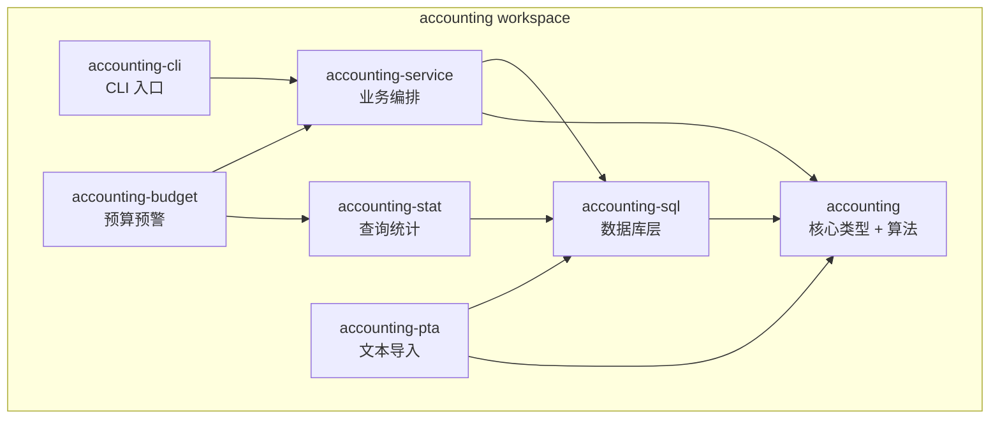
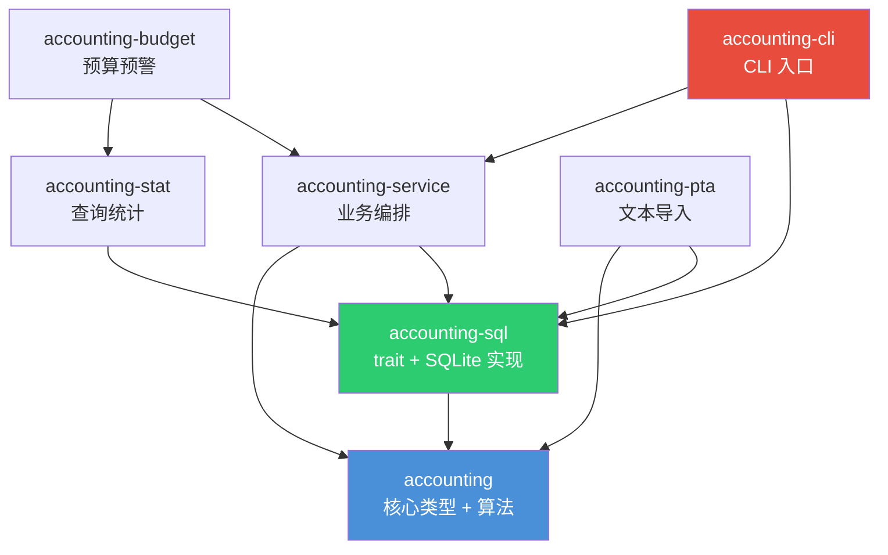
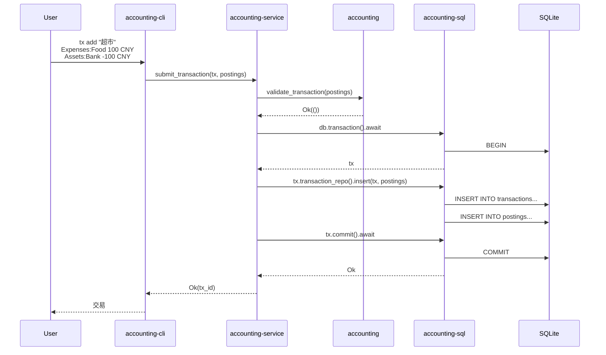
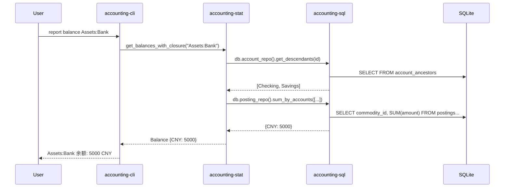

# 架构设计：Workspace 与路线图

> Crate 职责、依赖关系、数据库抽象、技术栈与分阶段实现路线。

## 1. Workspace 结构

## 2. Crate 职责与边界

### 2.1 `accounting` — 核心库

**职责**：数据类型定义 + 纯算法（零 IO，零数据库依赖）

**包含**：

- `Account`、`Transaction`、`Posting`、`Commodity`、`Member`、`Channel`、`Tag`、`Attachment` 等类型
- `AccountType`、`InstallmentMethod` 枚举
- 验证算法、余额计算、闭包表计算、分期期数推断

**不依赖**：任何 workspace 内 crate、任何数据库驱动

### 2.2 `accounting-sql` — 数据库层

**职责**：数据库表结构 + Repository trait 定义 + SQLite 实现 + 连接管理

**设计要点**：

- 每个领域定义一个 Repository trait（如 `AccountRepo`、`TransactionRepo`），向上暴露同步 CRUD 接口
- `Database` trait 聚合所有 Repository，提供 `transaction()` 方法获取事务上下文
- `Transaction` trait 包含所有 Repository 方法 + `commit()`，支持事务内多操作原子提交
- `Drop` 时自动回滚未提交的事务
- 使用 Rust 1.75+ 原生 async trait（`#[allow(async_fn_in_trait)]`），不引入 `async_trait` crate
- Repository 方法为同步（`fn`），`Database::transaction()` 和 `Transaction::commit()` 为 async

**可替换性**：更换 `Database` trait 的实现即可切换底层数据库（如 SQLite → PostgreSQL）

### 2.3 `accounting-service` — 业务层

**职责**：事务编排 + 业务逻辑

**设计要点**：

- 接收 `Database` trait 泛型参数（如 `D: Database`）
- 事务编排：获取 `Database` → `transaction()` → 多个 Repository 操作 → `commit()`
- 业务验证：在事务开始前调用核心库的验证算法
- 不涉及具体 SQL，只通过 Repository trait 调用

### 2.4 `accounting-stat` — 查询统计

**职责**：只读查询、报表生成、核对

**设计要点**：

- 通过 `Database` trait 只读访问数据库
- 不依赖 `accounting-service`

### 2.5 `accounting-pta` — PTA 文本解析

**职责**：解析 `.beancount`/`.ledger` 文本，通过 `Database` trait 写入数据库

### 2.6 `accounting-budget` — 预算预警

**职责**：预算设定、支出追踪、预警触发

**外部依赖**：`accounting-stat`（查询统计）、`accounting-service`（写入预算配置）

### 2.7 `accounting-cli` — CLI 入口

**职责**：命令行界面，初始化 `SqliteDatabase` 并注入到 `accounting-service`

## 3. 依赖关系图

## 4. 数据流

### 4.1 创建交易（Service 层事务编排）

### 4.2 查询余额（Stat 层只读查询）

## 5. 技术栈

| 用途 | 选型 | 说明 |
|------|------|------|
| 语言 | Rust (Edition 2024) | 项目语言 |
| 异步运行时 | `tokio` | Service 层 async |
| 数据库 | SQLite | 嵌入式、零配置，可替换 |
| SQLite 驱动 | `rusqlite` | Rust 最成熟的 SQLite 绑定 |
| 十进制数 | `rust_decimal` | 金融计算标准库 |
| 日期时间 | `chrono` | Rust 标准日期库 |
| CLI 框架 | `clap` | 命令行解析 |
| 错误处理 | `thiserror` + `anyhow` | 结构化错误 |
| 测试 | 内置 `cargo test` | 单元测试 + 集成测试 |

## 6. 路线图

### Phase 1：带所有记账功能的 CLI

**目标**：一次性实现核心库全部功能，提供完整 CLI 记账工具

**包含 crate**：

- `accounting` — 核心类型 + 验证算法（含多币种/换汇/分期推断）
- `accounting-sql` — Database trait + Repository traits + SQLite 实现 + 全部表结构
- `accounting-service` — 事务编排 + 业务逻辑
- `accounting-cli` — CLI 入口

**功能**：

- 账户 CRUD（含层次结构、级联关闭/开启、系统内置节点）
- 交易 CRUD（单币种 + 多币种换汇、双边 Cost、附件、标签）
- 成员管理、渠道管理
- 余额查询（单账户 + 闭包表聚合）

**周期**：4-6 周

### Phase 2：查询、统计、预算 + PTA 导入

**目标**：报表统计、预算、PTA 文本导入，全部通过 CLI 调用

**新增 crate**：

- `accounting-stat` — 查询统计、报表生成、现金流量表推算
- `accounting-budget` — 预算设定、追踪、预警
- `accounting-pta` — Beancount/Ledger 语法解析与导入

**功能**：

- 资产负债表、利润表
- 按标签/渠道/成员统计
- 现金流量表推算（基于信用账户账单日/还款日 + 分期数据）
- 预算上限设定与超支预警
- 对账功能
- PTA 文本导入

**周期**：3-4 周

### Phase 3：Web UI

**目标**：设计和实现 Web 用户界面

**功能**：

- Web 前端（账户树、交易列表、报表图表）
- 交易录入表单（支持附件上传）
- 可视化报表（资产负债表、利润表、现金流趋势）
- 预算仪表盘

**周期**：待定

## 7. 关键设计原则

1. **核心库零数据库依赖**：`accounting` crate 不引用任何数据库驱动，确保算法可独立测试
2. **数据库可替换**：所有数据库操作通过 Repository trait 抽象，更换 `Database` trait 的实现即可切换数据库
3. **事务编排由 Service 层负责**：sql crate 只提供 Repository 操作和事务接口，service crate 负责 `BEGIN → 多操作 → COMMIT/ROLLBACK` 的编排
4. **Repository 同步、事务接口 async**：Repository 方法为同步（`fn`），`Database::transaction()` 和 `Transaction::commit()` 为 async（原生 async trait，不用 `async_trait` crate）
5. **硬删除即物理删除**：不保留 `deleted_at`，删除后不可恢复（依赖外部备份）
6. **整数存储 + Decimal API**：数据库层存整数（按 precision 缩放），核心库 API 使用 Decimal
7. **闭包表即时维护**：插入账户时同步计算并写入闭包记录，不异步重建
8. **系统内置节点不可删除**：`is_system = true` 的账户禁止删除，但允许重命名
9. **枚举字段整数化**：数据库中存 INTEGER 枚举，应用层用 Rust enum 封装
10. **现金流量表推算**：结合信用账户的 `billing_day` / `repayment_day` 与分期交易数据，由 `accounting-stat` 推算未来现金流（不存储当前期数，实时计算）
11. **级联关闭/开启**：父账户关闭时自动关闭所有子账户；重新开启时恢复之前同时关闭的子账户
