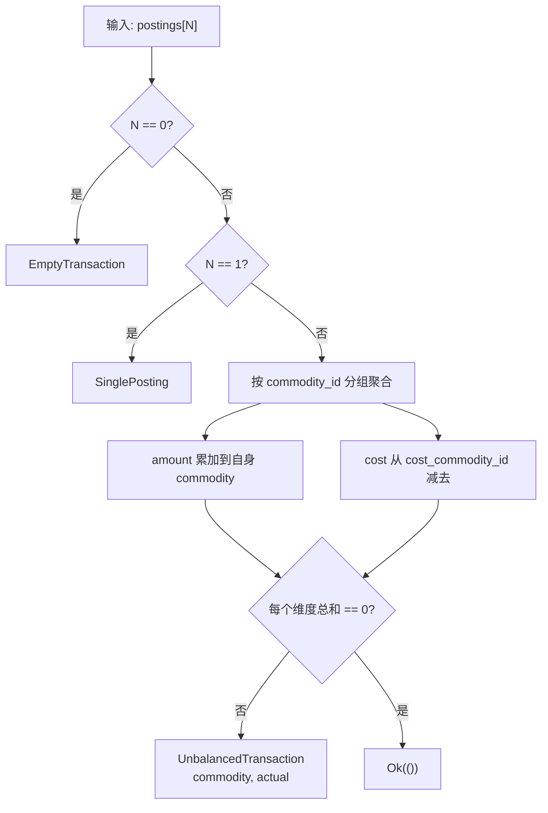
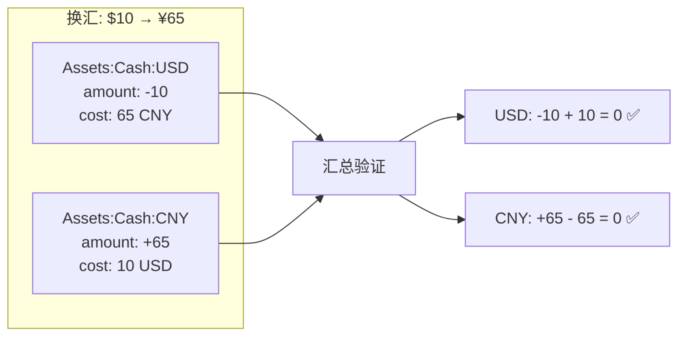
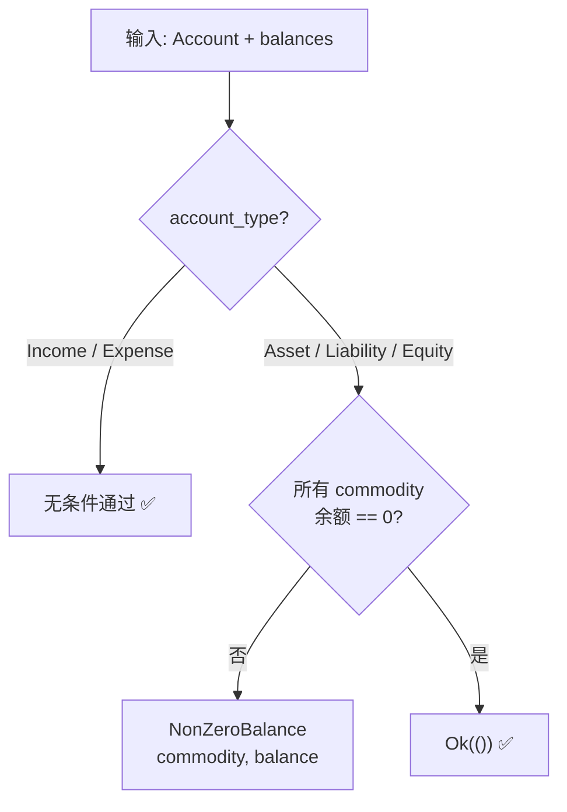
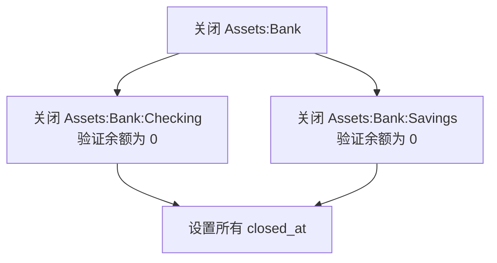
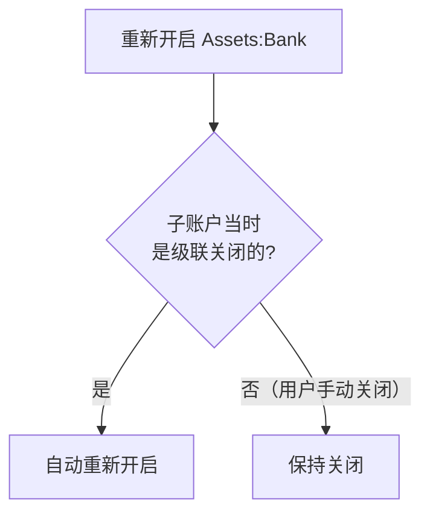
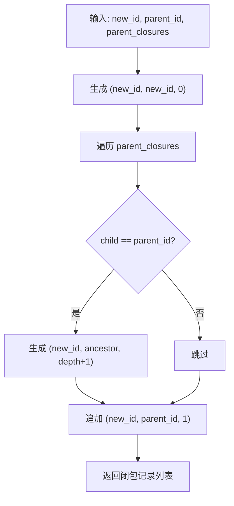

# 核心库设计：`accounting` crate

> 数据结构设计、核心行为规格、算法约束。

## 1. 数据类型

### 1.1 账户类型

```rust
enum AccountType {
    /// 你拥有的东西：现金、银行卡、房产
    Asset = 1,
    /// 你欠别人的东西：信用卡欠款、贷款
    Liability = 2,
    /// 净资产：初始投资、累计利润
    Equity = 3,
    /// 收入来源：工资、投资收益
    Income = 4,
    /// 支出：食品、交通
    Expense = 5,
}
```

- Asset / Liability / Equity 关闭时要求所有 commodity 余额为 0
- Income / Expense 无条件关闭，余额保留为总收支

### 1.2 分期方式

```rust
enum InstallmentMethod {
    /// 等额本息
    EqualPrincipalAndInterest = 1,
    /// 等额本金
    EqualPrincipal = 2,
    /// 先息后本
    InterestOnly = 3,
}
```

### 1.3 ID 类型

```rust
/// 账户 ID
struct AccountId(i64);

/// 交易 ID
struct TransactionId(i64);

/// 分录 ID
struct PostingId(i64);

/// 成员 ID
struct MemberId(i64);

/// 渠道 ID
struct ChannelId(i64);
```

### 1.4 Account

```rust
struct Account {
    /// 账户 ID
    id: AccountId,
    /// 完整层次路径，全局唯一
    full_name: String,
    /// 账户类型
    account_type: AccountType,
    /// 直接父账户
    parent_id: Option<AccountId>,
    /// 开户日期
    opened_at: NaiveDate,
    /// 关闭日期
    closed_at: Option<NaiveDate>,
    /// 系统内置节点
    is_system: bool,
    /// 信用账户出账日（1-31）
    billing_day: Option<u8>,
    /// 信用账户还款日（1-31）
    repayment_day: Option<u8>,
}
```

**派生行为**：

- `billing_day` 或 `repayment_day` 有值 → 该账户为信用账户
- `account_type` 为 Asset / Liability / Equity → 关闭时须余额为 0

### 1.5 Commodity

```rust
struct Commodity {
    /// 自然主键，如 "CNY"
    symbol: String,
    /// 人类可读名称
    name: String,
    /// 记账精度小数位
    precision: u8,
    /// 显示精度
    display_precision: u8,
}
```

**约束**：金额在数据库中以整数存储，按 `10^precision` 缩放。如 CNY precision=2，数据库值 10000 表示 100.00。

### 1.6 Transaction

```rust
struct Transaction {
    /// 交易 ID
    id: TransactionId,
    /// 交易时间，精确到秒
    datetime: NaiveDateTime,
    /// 交易描述
    narration: String,
    /// 对手方
    payee: Option<String>,
    /// 交易渠道
    channel_id: Option<ChannelId>,
    /// 记录者
    creator_id: Option<MemberId>,
    /// 创建时间
    created_at: NaiveDateTime,
    /// 最后修改时间
    updated_at: NaiveDateTime,
    /// 分期总期数
    installment_total: Option<u16>,
    /// 分期方式
    installment_method: Option<InstallmentMethod>,
}
```

### 1.7 Posting

```rust
struct Posting {
    /// 分录 ID
    id: PostingId,
    /// 所属交易
    transaction_id: TransactionId,
    /// 所属账户
    account_id: AccountId,
    /// commodity 符号，如 "CNY"
    commodity_id: String,
    /// 金额，正负表示方向
    amount: Decimal,
    /// 总成本基础
    cost: Option<Decimal>,
    /// cost 参考 commodity
    cost_commodity_id: Option<String>,
    /// 交易内排序
    position: u16,
}
```

**语义**：

- `amount` 为正 → 该账户增加该 commodity
- `amount` 为负 → 该账户减少该 commodity
- `cost` 与 `cost_commodity_id` 成对出现，表示该 posting 在 cost_commodity 维度上的等值代价

### 1.8 Member

```rust
struct Member {
    /// 成员 ID
    id: MemberId,
    /// 名称
    name: String,
    /// 头像路径或 URL
    avatar: Option<String>,
}
```

### 1.9 Channel

```rust
struct Channel {
    /// 渠道 ID
    id: ChannelId,
    /// 如 "支付宝"、"微信支付"、"现金"
    name: String,
}
```

### 1.10 Tag

```rust
struct Tag {
    /// 标签 ID
    id: i64,
    /// 标签名
    name: String,
    /// 系统内置标记
    is_system: bool,
}
```

### 1.11 Attachment

```rust
struct Attachment {
    /// 附件 ID
    id: i64,
    /// 所属交易
    transaction_id: TransactionId,
    /// 含扩展名
    file_name: String,
    /// 二进制内容
    blob: Vec<u8>,
}
```

## 2. 核心行为规格

### 2.1 复式记账验证

**输入**：一组 Posting（N ≥ 2）

**输出**：Ok(()) 或 ValidationError

**行为**：



1. 空交易 → `EmptyTransaction`
2. 单分录 → `SinglePosting`
3. 按 `commodity_id` 分组聚合：
   - 每个 posting 的 `amount` 累加到自身 `commodity_id`
   - 若 posting 有 `cost` 和 `cost_commodity_id`，将 `cost` 从 `cost_commodity_id` 维度减去
4. 检查每个 commodity 维度的总和是否为零
5. 任一维度非零 → `UnbalancedTransaction(commodity, actual)`

**换汇场景验证**（$10 → ¥65）：



| Posting | Amount | Cost | USD 维度 | CNY 维度 |
|---------|--------|------|---------|---------|
| Cash:USD | -10 USD | 65 CNY | -10 | +65 |
| Cash:CNY | +65 CNY | 10 USD | -10 | +65 |
| **总计** | | | **0** | **0** |

> **设计背景**：使用 Cost（总价）而非 Price（单价），避免 `10/65 = 0.153846...` 的无限循环小数精度问题。使用双边 Cost 使每个 commodity 维度都严格平衡，不依赖宽松验证。

### 2.2 余额计算

**输入**：账户 ID、commodity ID、Posting 列表

**输出**：Decimal

**行为**：筛选出该账户且该 commodity 的所有 posting，`amount` 求和。

**扩展行为**（含子账户）：

- 通过闭包表获取该账户及其所有后代账户的 ID 集合
- 对上述所有账户的 posting 按 commodity 分组求和

### 2.3 账户关闭验证

**输入**：Account、该账户在各 commodity 上的余额映射

**输出**：Ok(()) 或 CloseError

**行为**：



- Income / Expense：无条件通过
- Asset / Liability / Equity：检查每个 commodity 余额是否为零；任一非零 → `NonZeroBalance(commodity, balance)`

**级联关闭**：



关闭父账户时，递归关闭所有子账户。子账户关闭遵循各自的关闭条件（Asset 子账户仍需余额为零）。

**级联重新开启**：



重新开启父账户时，仅恢复之前**同时被级联关闭**的子账户。用户手动关闭的子账户不自动恢复。

### 2.4 闭包表计算

**输入**：新账户 ID、父账户 ID、父账户已有的闭包记录列表

**输出**：应插入的闭包记录列表 `(account_id, ancestor_id, depth)`

**行为**：



1. 生成 `(new_id, new_id, 0)` —— 自身到自身，depth=0
2. 遍历父账户的闭包记录，筛选 `child == parent_id` 的记录
3. 对每个匹配的 `(parent_id, ancestor, depth)`，生成 `(new_id, ancestor, depth + 1)`
4. 追加 `(new_id, parent_id, 1)` —— 到直接父节点

**示例**：在 `Assets:Bank`（id=2）下创建 `Assets:Bank:Checking`（id=3），`Assets`（id=1）已有闭包 `(2,2,0), (2,1,1)`

| 步骤 | 生成记录 | 说明 |
|------|---------|------|
| 1 | `(3, 3, 0)` | 自身 |
| 2 | `(3, 2, 1)` | 继承父到 Assets 的关系（depth+1） |
| 3 | `(3, 1, 2)` | 继承父到根的关系（depth+1） |
| 4 | `(3, 2, 1)` | 到直接父节点 |

### 2.5 分期期数推断

**输入**：交易日期、当前日期、还款日（1-31）、总期数

**输出**：当前期数（0 到 total 之间）

**行为**：

1. 从交易日期所在月开始，逐月推算还款日
2. 还款日超出当月天数的，取当月最后一天
3. 统计截至当前日期已过的还款日数量
4. 不超过总期数

> 不存储当前期数，每次查询时实时计算。

## 3. 金额缩放

数据库中金额以整数存储，按 commodity 的 precision 缩放。

| Commodity | precision | 数据库值 | 实际值 |
|-----------|-----------|---------|--------|
| CNY | 2 | 10000 | 100.00 |

**缩放函数**（核心库提供）：

- `to_db_amount(value, precision)`：Decimal → 整数（乘以 10^precision，四舍五入）
- `from_db_amount(value, precision)`：整数 → Decimal（除以 10^precision）

## 4. 错误类型

| 错误 | 触发条件 |
|------|---------|
| `EmptyTransaction` | 交易无任何 posting |
| `SinglePosting` | 交易仅有 1 个 posting |
| `UnbalancedTransaction(commodity, actual)` | 某 commodity 维度总和 ≠ 0 |
| `NonZeroBalanceOnClose(commodity, balance)` | Asset/Liability/Equity 关闭时余额非零 |
| `AccountNotFound(id)` | 账户不存在 |
| `CommodityNotFound(symbol)` | Commodity 不存在 |
| `MemberNotFound(id)` | 成员不存在 |
| `ChannelNotFound(id)` | 渠道不存在 |
| `AccountAlreadyClosed(id)` | 关闭已关闭的账户 |
| `AccountNotClosed(id)` | 重新开启未关闭的账户 |
| `ParentAccountClosed(id)` | 在已关闭的父账户下创建子账户 |
| `DuplicateAccountName(name)` | 账户 full_name 重复 |
| `DuplicateCommoditySymbol(symbol)` | Commodity symbol 重复 |
