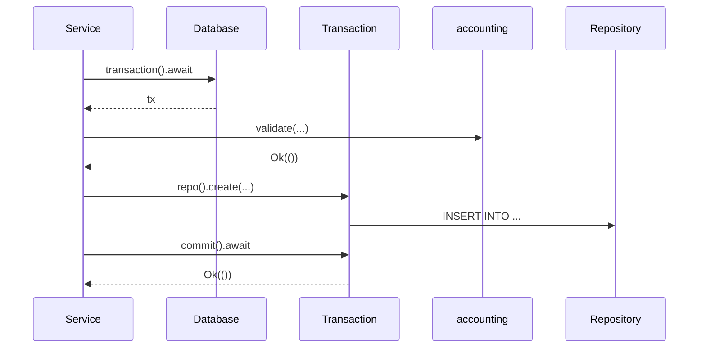
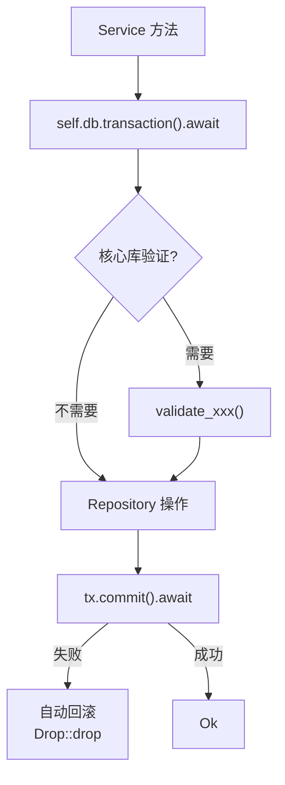
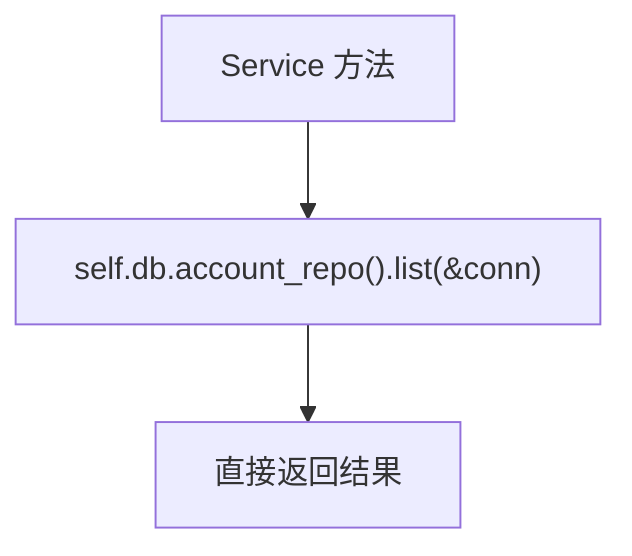

# 业务层设计：`accounting-service` crate

> 事务编排、业务验证、服务接口。

## 1. 设计原则

- Service 层持有 `Database` trait 实例，通过泛型参数注入
- 所有写操作在事务内编排：`BEGIN → 核心库验证 → Repository 操作 → COMMIT`
- 核心库验证（复式记账恒等式、账户关闭条件等）在 `BEGIN` 之后、`Repository` 操作之前执行
- 事务回滚由 `Transaction` 的 `Drop` 自动处理（未 commit 即回滚）
- 读操作可直接通过 `db.account_repo()` 等调用，不走事务

## 2. 事务编排模式



## 3. 服务接口

### 3.1 AccountService

```rust
struct AccountService<D: Database> {
    db: D,
}

impl<D: Database> AccountService<D> {
    /// 创建账户 + 同步写入闭包表
    async fn create(&self, account: Account) -> Result<AccountId, Error> {
        let tx = self.db.transaction().await?;
        // 验证父账户存在且未关闭
        if let Some(parent_id) = account.parent_id {
            let parent = tx.account().get(&tx.conn(), parent_id)?;
            // ...
        }
        // 插入账户
        let id = tx.account().create(&tx.conn(), &account)?;
        // 计算并插入闭包记录
        if let Some(parent_id) = account.parent_id {
            let closures = compute_closure(id, parent_id, &parent_closures);
            for (a, anc, d) in closures {
                // insert into account_ancestors
            }
        }
        tx.commit().await?;
        Ok(id)
    }

    /// 关闭账户（含余额验证 + 级联关闭子账户）
    async fn close(&self, id: AccountId) -> Result<(), Error> {
        let tx = self.db.transaction().await?;
        let account = tx.account().get(&tx.conn(), id)?.ok_or(Error::NotFound)?;
        // Asset/Liability/Equity 需余额为 0
        if account.account_type.requires_zero_balance_on_close() {
            let balances = tx.posting().sum_by_account(&tx.conn(), id)?;
            validate_account_close(&account, &balances)?;
        }
        // 级联关闭子账户
        let children = tx.account().list_children(&tx.conn(), id)?;
        for child in children {
            tx.account().close(&tx.conn(), child.id)?;
        }
        // 关闭自身
        tx.account().close(&tx.conn(), id)?;
        tx.commit().await?;
        Ok(())
    }

    /// 重新开启账户（级联恢复同时关闭的子账户）
    async fn reopen(&self, id: AccountId) -> Result<(), Error> {
        let tx = self.db.transaction().await?;
        // 重新开启自身
        tx.account().reopen(&tx.conn(), id)?;
        // 级联恢复同时被级联关闭的子账户
        // （需记录当时关闭方式，此处略）
        tx.commit().await?;
        Ok(())
    }
}
```

### 3.2 TransactionService

```rust
struct TransactionService<D: Database> {
    db: D,
}

impl<D: Database> TransactionService<D> {
    /// 提交交易：验证 → 插入交易 + 分录 → commit
    async fn submit(&self, tx: Transaction, postings: Vec<Posting>) -> Result<TransactionId, Error> {
        // 事务前验证
        validate_transaction(&postings)?;
        // 数据库事务
        let db_tx = self.db.transaction().await?;
        let id = db_tx.transaction().insert(&db_tx.conn(), &tx, &postings)?;
        db_tx.commit().await?;
        Ok(id)
    }

    /// 修改交易：删除旧分录 → 重新插入新分录
    async fn update(&self, id: TransactionId, tx: Transaction, postings: Vec<Posting>) -> Result<(), Error> {
        validate_transaction(&postings)?;
        let db_tx = self.db.transaction().await?;
        db_tx.transaction().delete(&db_tx.conn(), id)?;
        db_tx.transaction().insert(&db_tx.conn(), &tx, &postings)?;
        db_tx.commit().await?;
        Ok(())
    }

    /// 硬删除交易（级联删除 postings、attachments、transaction_tags）
    async fn delete(&self, id: TransactionId) -> Result<(), Error> {
        let db_tx = self.db.transaction().await?;
        // 级联删除由外键约束自动处理
        db_tx.transaction().delete(&db_tx.conn(), id)?;
        db_tx.commit().await?;
        Ok(())
    }
}
```

### 3.3 ReportService

```rust
struct ReportService<D: Database> {
    db: D,
}

impl<D: Database> ReportService<D> {
    /// 资产负债表：查询所有 Asset/Liability/Equity 账户的余额
    async fn balance_sheet(&self) -> Result<Vec<(Account, HashMap<String, Decimal>)>, Error> {
        let accounts = self.db.account().list(&self.db.conn())?;
        let mut result = vec![];
        for account in accounts {
            if matches!(account.account_type, Asset | Liability | Equity) {
                let balances = self.db.posting().sum_by_account(&self.db.conn(), account.id)?;
                result.push((account, balances));
            }
        }
        Ok(result)
    }

    /// 利润表：查询 Income/Expense 账户的余额
    async fn income_statement(&self, start: NaiveDateTime, end: NaiveDateTime) -> Result<Vec<(Account, Decimal)>, Error> {
        // 筛选日期范围内的 posting，按 Income/Expense 账户分组求和
        let postings = self.db.posting().list_in_range(&self.db.conn(), start, end)?;
        // ...
        Ok(result)
    }

    /// 账户余额（含子账户聚合）
    async fn get_balance(&self, account_id: AccountId) -> Result<HashMap<String, Decimal>, Error> {
        // 通过闭包表获取所有后代账户
        let descendants = self.db.account().get_descendants(&self.db.conn(), account_id)?;
        let ids: Vec<AccountId> = descendants.into_iter().map(|a| a.id).collect();
        let balances = self.db.posting().sum_by_accounts(&self.db.conn(), &ids)?;
        Ok(balances)
    }
}
```

## 4. 事务编排的典型模式

### 4.1 写操作（必须走事务）



### 4.2 读操作（不走事务）



## 5. 错误处理

Service 层错误类型：

| 错误 | 来源 | 处理 |
|------|------|------|
| `ValidationError` | 核心库验证失败 | 事务前返回，不走数据库 |
| `RepositoryError` | SQL 执行失败 | 事务内失败，Drop 时自动回滚 |
| `CommitError` | COMMIT 失败 | 事务已执行，数据未持久化 |
| `NotFound` | 查询无结果 | 直接返回 |

## 6. 测试策略

- **单元测试**：使用 `SqliteDatabase::new_in_memory()` 创建内存数据库，注入到 Service 中测试
- **集成测试**：测试 Service → Database → Repository → SQLite 完整链路
- **核心库测试**：独立于数据库，直接测试验证算法
