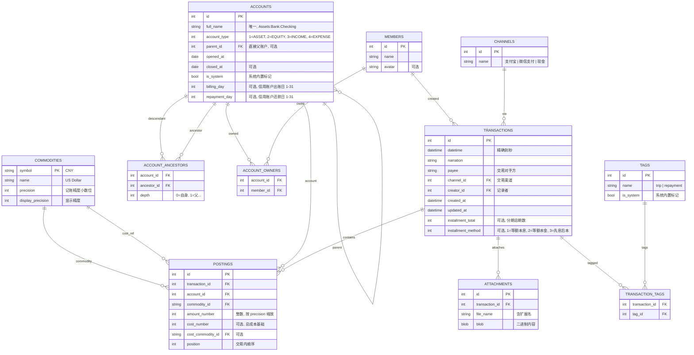

# 数据库设计：`accounting-sql` crate

> 完整表结构、索引、约束与系统内置数据。

## 1. ER 图



## 2. 表结构详解

### 2.1 `commodities`

| 字段 | 类型 | 约束 | 说明 |
|------|------|------|------|
| `symbol` | TEXT | PRIMARY KEY | 自然主键，内置为 `"CNY"`，其他由用户创建 |
| `name` | TEXT | NOT NULL | 人类可读名称 |
| `precision` | INTEGER | NOT NULL | 记账精度小数位（如 CNY=2 表示精确到分） |
| `display_precision` | INTEGER | NOT NULL | 显示精度 |

**内置数据**：

| symbol | name | precision | display_precision |
|--------|------|-----------|-------------------|
| CNY | 人民币 | 2 | 2 |

### 2.2 `accounts`

| 字段 | 类型 | 约束 | 说明 |
|------|------|------|------|
| `id` | INTEGER | PRIMARY KEY AUTOINCREMENT | |
| `full_name` | TEXT | UNIQUE NOT NULL | 完整层次路径 |
| `account_type` | INTEGER | NOT NULL CHECK(account_type BETWEEN 1 AND 4) | 1=Asset, 2=Equity, 3=Income, 4=Expense |
| `parent_id` | INTEGER | FK → accounts(id) | 直接父账户 |
| `opened_at` | DATE | NOT NULL | |
| `closed_at` | DATE | | 关闭日期 |
| `is_system` | INTEGER | NOT NULL DEFAULT 0 | 0/1 |
| `billing_day` | INTEGER | CHECK(billing_day BETWEEN 1 AND 31) | 信用账户出账日 |
| `repayment_day` | INTEGER | CHECK(repayment_day BETWEEN 1 AND 31) | 信用账户还款日 |

**内置数据**（`is_system = 1`）：

| full_name | account_type | opened_at |
|-----------|--------------|-----------|
| Assets | 1 (Asset) | 1970-01-01 |
| Equity | 2 (Equity) | 1970-01-01 |
| Income | 3 (Income) | 1970-01-01 |
| Expenses | 4 (Expense) | 1970-01-01 |
| Equity:OpeningBalances | 2 (Equity) | 1970-01-01 |
| Equity:Cashback | 2 (Equity) | 1970-01-01 |
| Equity:Discounts | 2 (Equity) | 1970-01-01 |
| Expenses:Fees | 4 (Expense) | 1970-01-01 |
| Expenses:InstallmentFees | 4 (Expense) | 1970-01-01 |
| Assets:Cash | 1 (Asset) | 1970-01-01 |

### 2.3 `account_ancestors`

| 字段 | 类型 | 约束 | 说明 |
|------|------|------|------|
| `account_id` | INTEGER | FK → accounts(id) | 后代账户 |
| `ancestor_id` | INTEGER | FK → accounts(id) | 祖先账户 |
| `depth` | INTEGER | NOT NULL | 0=自身, 1=父, 2=祖父... |

**主键**：`(account_id, ancestor_id)`

### 2.4 `account_owners`

| 字段 | 类型 | 约束 | 说明 |
|------|------|------|------|
| `account_id` | INTEGER | FK → accounts(id) | |
| `member_id` | INTEGER | FK → members(id) | |

**主键**：`(account_id, member_id)`

### 2.5 `members`

| 字段 | 类型 | 约束 | 说明 |
|------|------|------|------|
| `id` | INTEGER | PRIMARY KEY AUTOINCREMENT | |
| `name` | TEXT | NOT NULL | |
| `avatar` | TEXT | | 头像路径/URL |

### 2.6 `channels`

| 字段 | 类型 | 约束 | 说明 |
|------|------|------|------|
| `id` | INTEGER | PRIMARY KEY AUTOINCREMENT | |
| `name` | TEXT | UNIQUE NOT NULL | 支付宝、微信支付、现金 |

### 2.7 `tags`

| 字段 | 类型 | 约束 | 说明 |
|------|------|------|------|
| `id` | INTEGER | PRIMARY KEY AUTOINCREMENT | |
| `name` | TEXT | UNIQUE NOT NULL | |
| `is_system` | INTEGER | NOT NULL DEFAULT 0 | 0/1 |

**内置数据**（`is_system = 1`）：

| name |
|------|
| repayment |

### 2.8 `transactions`

| 字段 | 类型 | 约束 | 说明 |
|------|------|------|------|
| `id` | INTEGER | PRIMARY KEY AUTOINCREMENT | |
| `datetime` | DATETIME | NOT NULL | 交易时间，精确到秒 |
| `narration` | TEXT | NOT NULL | 交易描述 |
| `payee` | TEXT | | 对手方 |
| `channel_id` | INTEGER | FK → channels(id) | 渠道 |
| `creator_id` | INTEGER | FK → members(id) | 记录者 |
| `created_at` | DATETIME | NOT NULL DEFAULT CURRENT_TIMESTAMP | |
| `updated_at` | DATETIME | NOT NULL DEFAULT CURRENT_TIMESTAMP | |
| `installment_total` | INTEGER | | 分期总期数 |
| `installment_method` | INTEGER | CHECK(installment_method BETWEEN 1 AND 3) | 1=等额本息, 2=等额本金, 3=先息后本 |

### 2.9 `postings`

| 字段 | 类型 | 约束 | 说明 |
|------|------|------|------|
| `id` | INTEGER | PRIMARY KEY AUTOINCREMENT | |
| `transaction_id` | INTEGER | FK → transactions(id) ON DELETE CASCADE | |
| `account_id` | INTEGER | FK → accounts(id) | |
| `commodity_id` | TEXT | FK → commodities(symbol) | |
| `amount_number` | INTEGER | NOT NULL | 整数，按 commodity precision 缩放 |
| `cost_number` | INTEGER | | 总成本基础 |
| `cost_commodity_id` | TEXT | FK → commodities(symbol) | |
| `position` | INTEGER | NOT NULL | 交易内顺序 |

**关键约束**：每笔交易的 postings 在各 commodity 维度上总和为 0（应用层保证）。

### 2.10 `attachments`

| 字段 | 类型 | 约束 | 说明 |
|------|------|------|------|
| `id` | INTEGER | PRIMARY KEY AUTOINCREMENT | |
| `transaction_id` | INTEGER | FK → transactions(id) ON DELETE CASCADE | |
| `file_name` | TEXT | NOT NULL | 含扩展名 |
| `blob` | BLOB | NOT NULL | 二进制内容 |

### 2.11 `transaction_tags`

| 字段 | 类型 | 约束 | 说明 |
|------|------|------|------|
| `transaction_id` | INTEGER | FK → transactions(id) ON DELETE CASCADE | |
| `tag_id` | INTEGER | FK → tags(id) ON DELETE CASCADE | |

**主键**：`(transaction_id, tag_id)`

## 3. 索引设计

| 表 | 索引字段 | 用途 |
|----|---------|------|
| `accounts` | `full_name` | UNIQUE，快速定位账户 |
| `accounts` | `parent_id` | 查询子账户 |
| `accounts` | `account_type` | 按类型筛选 |
| `account_ancestors` | `ancestor_id` | 查询某账户的所有后代 |
| `account_ancestors` | `account_id` | 查询某账户的所有祖先 |
| `postings` | `transaction_id` | 查询交易的分录 |
| `postings` | `account_id` | 查询账户的历史分录 |
| `postings` | `(account_id, commodity_id)` | 按 commodity 计算余额 |
| `transactions` | `datetime` | 按时间范围查询 |
| `transactions` | `channel_id` | 按渠道统计 |
| `transactions` | `creator_id` | 按成员查询 |
| `attachments` | `transaction_id` | 查询交易的附件 |
| `transaction_tags` | `tag_id` | 查询标签关联的交易 |

## 4. 删除策略

| 操作 | 影响 |
|------|------|
| 删除 `transactions` | CASCADE 级联删除关联 `postings` 和 `attachments` 和 `transaction_tags` |
| 删除 `accounts` | 需应用层先处理：验证余额、级联关闭子账户、更新 `account_ancestors` |
| 删除 `commodities` | 需应用层先处理：确保无 posting 引用 |
| 删除 `members` | 需应用层先处理：确保无交易引用 `creator_id` |
| 删除 `channels` | 需应用层先处理：确保无交易引用 |
| 删除 `tags` | CASCADE 级联删除 `transaction_tags` 关联记录 |

## 5. 金额存储规则

所有金额字段（`amount_number`, `cost_number`）在数据库中均存储为**整数**，按对应 commodity 的 `precision` 缩放：

| Commodity | precision | 数据库值 | 实际值 |
|-----------|-----------|---------|--------|
| CNY | 2 | 10000 | 100.00 |

缩放公式由核心库 `accounting::to_db_amount` / `from_db_amount` 提供。

## 6. 数据库创建顺序

1. commodities -- 无依赖
2. members -- 无依赖
3. channels -- 无依赖
4. tags -- 无依赖
5. accounts -- 无依赖（parent_id 可为空）
6. account_ancestors -- 依赖 accounts
7. account_owners -- 依赖 accounts, members
8. transactions -- 依赖 channels, members
9. postings -- 依赖 transactions, accounts, commodities
10. attachments -- 依赖 transactions
11. transaction_tags -- 依赖 transactions, tags

## 7. Repository 设计

### 7.1 设计原则

- Repository 方法为**同步**（`fn`），接收 `&Connection` 执行单条 SQL
- `Database` trait 聚合所有 Repository，提供 `transaction()` 获取事务上下文
- `Transaction` trait 包含所有 Repository + `commit()`，支持原子提交
- 不使用 `async_trait` crate，Repository 本身无 async；`Database::transaction()` 和 `Transaction::commit()` 使用原生 async trait
- `Transaction` 的 `Drop` 实现自动回滚未提交的事务

### 7.2 ConnectionPool

```rust
struct ConnectionPool {
    conn: Arc<Mutex<Connection>>,
}

impl ConnectionPool {
    /// 打开指定路径的 SQLite 数据库
    fn new(path: &str) -> Self
    /// 打开内存数据库（测试用）
    fn new_in_memory() -> Self
    /// 获取连接锁
    fn get(&self) -> MutexGuard<Connection>
    /// 执行 schema.sql 初始化表结构
    fn initialize_schema(&self) -> Result<(), Error>
}
```

### 7.3 Repository Traits

每个领域一个 Repository trait，同步接口：

```rust
trait AccountRepo {
    /// 创建账户，返回账户 ID
    fn create(&self, conn: &Connection, account: &Account) -> Result<AccountId, Error>
    /// 根据 ID 查询
    fn get(&self, conn: &Connection, id: AccountId) -> Result<Option<Account>, Error>
    /// 根据 full_name 查询
    fn get_by_name(&self, conn: &Connection, name: &str) -> Result<Option<Account>, Error>
    /// 列出所有账户
    fn list(&self, conn: &Connection) -> Result<Vec<Account>, Error>
    /// 列出某账户的直接子账户
    fn list_children(&self, conn: &Connection, parent_id: AccountId) -> Result<Vec<Account>, Error>
    /// 关闭账户（设置 closed_at）
    fn close(&self, conn: &Connection, id: AccountId) -> Result<(), Error>
    /// 重新开启账户（清除 closed_at）
    fn reopen(&self, conn: &Connection, id: AccountId) -> Result<(), Error>
}

struct TransactionFilter {
    /// 起始时间（含）
    start_datetime: Option<NaiveDateTime>,
    /// 结束时间（含）
    end_datetime: Option<NaiveDateTime>,
    /// 对手方模糊匹配
    payee: Option<String>,
    /// 渠道 ID
    channel_id: Option<ChannelId>,
    /// 记录者 ID
    creator_id: Option<MemberId>,
    /// 是否分期交易（installment_total IS NOT NULL）
    has_installment: Option<bool>,
    /// 分期方式
    installment_method: Option<InstallmentMethod>,
    /// 标签 ID（通过 transaction_tags 关联筛选）
    tag_id: Option<i64>,
    /// 分页：每页数量
    limit: Option<usize>,
    /// 分页：偏移量
    offset: Option<usize>,
    /// 排序字段
    order_by: Option<TransactionOrderBy>,
    /// 排序方向
    order_direction: Option<OrderDirection>,
}

enum TransactionOrderBy {
    Datetime,
    CreatedAt,
    UpdatedAt,
}

enum OrderDirection {
    Asc,
    Desc,
}

trait TransactionRepo {
    /// 插入交易及全部分录，返回交易 ID
    fn insert(&self, conn: &Connection, tx: &Transaction, postings: &[Posting]) -> Result<TransactionId, Error>
    /// 硬删除交易（级联删除 postings、attachments、transaction_tags）
    fn delete(&self, conn: &Connection, id: TransactionId) -> Result<(), Error>
    /// 根据 ID 查询交易及其分录
    fn get(&self, conn: &Connection, id: TransactionId) -> Result<Option<(Transaction, Vec<Posting>)>, Error>
    /// 多条件筛选查询交易列表
    fn list(&self, conn: &Connection, filter: &TransactionFilter) -> Result<Vec<Transaction>, Error>
    /// 多条件筛选统计交易数量
    fn count(&self, conn: &Connection, filter: &TransactionFilter) -> Result<i64, Error>
}

trait PostingRepo {
    /// 列出某账户的所有分录
    fn list_by_account(&self, conn: &Connection, account_id: AccountId) -> Result<Vec<Posting>, Error>
    /// 列出某交易的所有分录
    fn list_by_transaction(&self, conn: &Connection, tx_id: TransactionId) -> Result<Vec<Posting>, Error>
    /// 按 commodity 汇总某账户的余额
    fn sum_by_account(&self, conn: &Connection, account_id: AccountId) -> Result<HashMap<String, Decimal>, Error>
    /// 按 commodity 汇总多个账户的余额（含闭包表聚合）
    fn sum_by_accounts(&self, conn: &Connection, account_ids: &[AccountId]) -> Result<HashMap<String, Decimal>, Error>
}

trait CommodityRepo {
    fn create(&self, conn: &Connection, commodity: &Commodity) -> Result<(), Error>
    fn get(&self, conn: &Connection, symbol: &str) -> Result<Option<Commodity>, Error>
    fn list(&self, conn: &Connection) -> Result<Vec<Commodity>, Error>
}

trait MemberRepo {
    fn create(&self, conn: &Connection, name: &str, avatar: Option<&str>) -> Result<MemberId, Error>
    fn get(&self, conn: &Connection, id: MemberId) -> Result<Option<Member>, Error>
    fn list(&self, conn: &Connection) -> Result<Vec<Member>, Error>
}

trait ChannelRepo {
    fn create(&self, conn: &Connection, name: &str) -> Result<ChannelId, Error>
    fn get(&self, conn: &Connection, id: ChannelId) -> Result<Option<Channel>, Error>
    fn list(&self, conn: &Connection) -> Result<Vec<Channel>, Error>
}

trait TagRepo {
    fn create(&self, conn: &Connection, name: &str) -> Result<i64, Error>
    fn get(&self, conn: &Connection, id: i64) -> Result<Option<Tag>, Error>
    fn list(&self, conn: &Connection) -> Result<Vec<Tag>, Error>
    /// 为交易添加标签
    fn attach_to_transaction(&self, conn: &Connection, tx_id: TransactionId, tag_id: i64) -> Result<(), Error>
    /// 移除交易的标签
    fn detach_from_transaction(&self, conn: &Connection, tx_id: TransactionId, tag_id: i64) -> Result<(), Error>
}

trait AttachmentRepo {
    fn create(&self, conn: &Connection, attachment: &Attachment) -> Result<i64, Error>
    fn list_by_transaction(&self, conn: &Connection, tx_id: TransactionId) -> Result<Vec<Attachment>, Error>
    fn delete(&self, conn: &Connection, id: i64) -> Result<(), Error>
}
```

### 7.4 Database / Transaction Traits

```rust
trait Database: Send + Sync {
    type Tx: Transaction;

    /// 获取成员仓储
    fn member(&self) -> impl MemberRepo
    /// 获取账户仓储
    fn account(&self) -> impl AccountRepo
    /// 获取交易仓储
    fn transaction(&self) -> impl TransactionRepo
    /// 获取分录仓储
    fn posting(&self) -> impl PostingRepo
    /// 获取 commodity 仓储
    fn commodity(&self) -> impl CommodityRepo
    /// 获取渠道仓储
    fn channel(&self) -> impl ChannelRepo
    /// 获取标签仓储
    fn tag(&self) -> impl TagRepo
    /// 获取附件仓储
    fn attachment(&self) -> impl AttachmentRepo

    /// 开启新事务（异步）
    async fn transaction(&self) -> Result<Self::Tx, Error>
}

trait Transaction: Send {
    /// 事务上下文内的成员仓储
    fn member(&self) -> impl MemberRepo
    /// 事务上下文内的账户仓储
    fn account(&self) -> impl AccountRepo
    /// 事务上下文内的交易仓储
    fn transaction(&self) -> impl TransactionRepo
    /// 事务上下文内的分录仓储
    fn posting(&self) -> impl PostingRepo
    /// 事务上下文内的 commodity 仓储
    fn commodity(&self) -> impl CommodityRepo
    /// 事务上下文内的渠道仓储
    fn channel(&self) -> impl ChannelRepo
    /// 事务上下文内的标签仓储
    fn tag(&self) -> impl TagRepo
    /// 事务上下文内的附件仓储
    fn attachment(&self) -> impl AttachmentRepo

    /// 提交事务（异步）
    async fn commit(self) -> Result<(), Error>
}
```

### 7.5 SQLite 实现

```rust
struct SqliteDatabase {
    pool: ConnectionPool,
}

impl SqliteDatabase {
    fn new(path: &str) -> Self
    fn new_in_memory() -> Self
}

impl Database for SqliteDatabase {
    type Tx = SqliteTransaction;

    fn member(&self) -> impl MemberRepo { SqliteMemberRepo { pool: self.pool.clone() } }
    fn account(&self) -> impl AccountRepo { SqliteAccountRepo { pool: self.pool.clone() } }
    fn transaction(&self) -> impl TransactionRepo { SqliteTransactionRepo { pool: self.pool.clone() } }
    fn posting(&self) -> impl PostingRepo { SqlitePostingRepo { pool: self.pool.clone() } }
    fn commodity(&self) -> impl CommodityRepo { SqliteCommodityRepo { pool: self.pool.clone() } }
    fn channel(&self) -> impl ChannelRepo { SqliteChannelRepo { pool: self.pool.clone() } }
    fn tag(&self) -> impl TagRepo { SqliteTagRepo { pool: self.pool.clone() } }
    fn attachment(&self) -> impl AttachmentRepo { SqliteAttachmentRepo { pool: self.pool.clone() } }

    async fn transaction(&self) -> Result<Self::Tx, Error> {
        let conn = self.pool.get()?;
        conn.execute("BEGIN", [])?;
        Ok(SqliteTransaction { pool: self.pool.clone(), committed: false })
    }
}

struct SqliteTransaction {
    pool: ConnectionPool,
    committed: bool,
}

impl Transaction for SqliteTransaction {
    fn member(&self) -> impl MemberRepo { SqliteMemberRepo { pool: self.pool.clone() } }
    fn account(&self) -> impl AccountRepo { SqliteAccountRepo { pool: self.pool.clone() } }
    fn transaction(&self) -> impl TransactionRepo { SqliteTransactionRepo { pool: self.pool.clone() } }
    fn posting(&self) -> impl PostingRepo { SqlitePostingRepo { pool: self.pool.clone() } }
    fn commodity(&self) -> impl CommodityRepo { SqliteCommodityRepo { pool: self.pool.clone() } }
    fn channel(&self) -> impl ChannelRepo { SqliteChannelRepo { pool: self.pool.clone() } }
    fn tag(&self) -> impl TagRepo { SqliteTagRepo { pool: self.pool.clone() } }
    fn attachment(&self) -> impl AttachmentRepo { SqliteAttachmentRepo { pool: self.pool.clone() } }

    async fn commit(mut self) -> Result<(), Error> {
        let conn = self.pool.get()?;
        conn.execute("COMMIT", [])?;
        self.committed = true;
        Ok(())
    }
}

/// 未 commit 即 Drop 时自动回滚
impl Drop for SqliteTransaction {
    fn drop(&mut self) {
        if !self.committed {
            if let Ok(conn) = self.pool.get() {
                let _ = conn.execute("ROLLBACK", []);
            }
        }
    }
}
```
